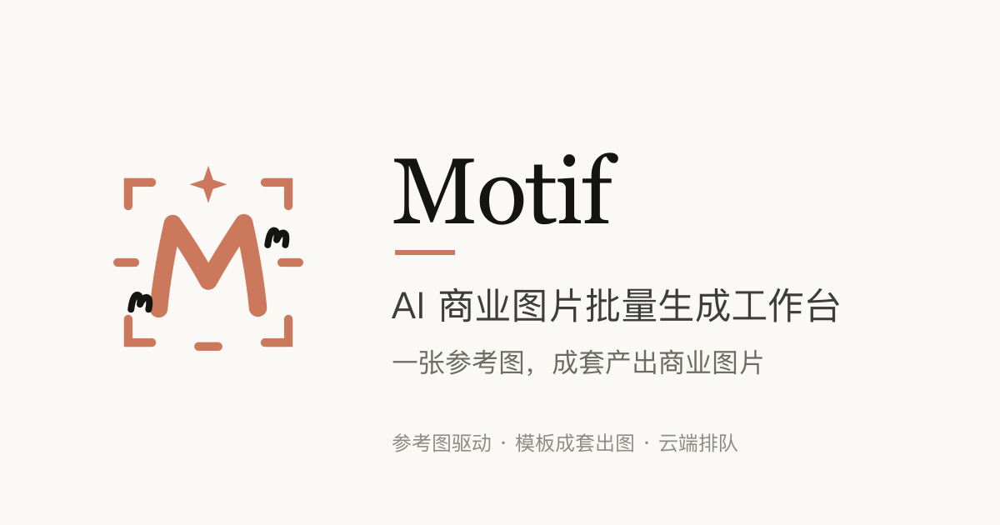

<div align="center">
  
</div>

# Motif — AI 商业图片批量生成工作台

以「参考图 + 模板 → 成套商业图片」为核心的全栈 SaaS 工作台。
前端为暗/亮双色单页应用（落地页 + 登录后工作台），服务端为 Next.js API 全栈实现，
生图走 OpenAI 兼容网关（gpt-image 系）真实出图。

<div align="center">
  
</div>


> 品牌、文案、模板提示词与全部代码均为原创实现。

## 技术栈

| 层 | 选型 |
| --- | --- |
| 前端 | Next.js 16 (App Router) · React 19 · Tailwind CSS 4 · **HeroUI v3**（唯一控件来源，语义令牌桥接 `DESIGN.md`）· 图标 `@gravity-ui/icons` |
| 服务端 | Next.js Route Handlers（与前端同仓同进程） |
| 状态 | zustand（画布 store：视口 / 摆放 / 选择 / 撤销栈） |
| 存储 | SQLite（better-sqlite3, WAL），图片文件存于 `.data/storage/` |
| 队列 | 进程内生成 Worker：租约认领 → 逐张生成 → 崩溃回收重排 |
| 生图 | `OpenAICompatProvider`：文生图（images/generations）+ 图生图（images/edits，参考图 multipart） |
| 提示词 | 服务端代理上游开源提示词源 + 落 SQLite 缓存（浏览器不直连外部） |
| 邮件 | `Mailer` 抽象：console（本地直出）/ SMTP（QQ·163·Gmail 等）/ Resend / SendGrid |
| 测试 | Vitest 单测（core / db / provider / 服务层 / mailer） + ego-browser 端到端测试 |
| 工程 | pnpm workspace monorepo · TypeScript strict · Docker 多阶段构建 |

## Monorepo 结构

```
motif/
├── apps/web/                  # Next.js 全栈应用（UI + API）
│   ├── src/app/               # 页面与 API 路由
│   │   ├── page.tsx           # / ：未登录落地页 / 已登录工作台
│   │   ├── admin/             # 管理后台（服务端角色守卫）：概览 · 用户 · CDK · 订单 · 反馈 · 生成日志 · 审计 · 系统设置
│   │   ├── billing/            # 收银台与结果页：mock / epay / stripe 渠道分流，支付结果展示
│   │   └── api/               # auth · topics(+watch, +canvas) · generate-images · canvas-images
│   │                          #   · prompts · reference-uploads · billing · redeem · feedback
│   │                          #   · messages/cancel · admin
│   ├── src/components/        # landing / workspace / canvas（交互画布）/ ui（IconButton 等）/ admin
│   ├── src/server/            # 会话、业务服务、队列 worker、Mailer、支付渠道适配层、提示词代理
│   ├── src/lib/               # 模板定义（原创文案）· 提示词源清单 · 画布内核 · API client
│   └── src/stores/            # zustand store（画布视口 / 摆放 / 选择 / 撤销栈）
├── packages/core/             # 纯领域层：类型 · ID · 额度规则 · 状态机 · 画布几何 · 校验
├── packages/db/               # SQLite 存储层（15 张表 + 仓储）
├── packages/image-provider/   # 生图 Provider（OpenAI 兼容网关）
├── scripts/cdk.mjs            # CDK 发放 CLI
├── scripts/admin.mjs          # 超级管理员凭据工具（重置密码 / 查看管理员）
├── Dockerfile                 # 多阶段构建（builder 构建 + slim 运行时，含运维脚本）
├── docker-compose.yml         # 一键部署（默认）：拉取 GHCR 预构建镜像 + 数据卷/环境变量/健康检查
├── docker-compose.build.yml   # 可选 overlay：把上面那份覆盖成「就地构建」（本地改过源码时用）
├── .env.docker.example        # Docker 部署配置模板（cp 成 .env 后填两项必需配置）
└── e2e/                       # ego-browser 测试：run.sh（主流程 5 轮）+ acceptance.sh（验收 A–G）
```

## 一、支持的能力

### 账号体系（真实）
- 邮箱 + 6 位验证码注册（注册赠送额度在后台「额度与奖励」可配，默认 3 张）、登录、退出
- 修改密码（校验旧密码）、忘记密码（验证码重置）、昵称与头像资料修改
- 会话 Cookie（httpOnly · 30 天）、scrypt 口令散列
- ⚠️ 验证码发信取决于 Mailer 配置：`console` 直出（本地）；`smtp/resend/sendgrid` 真实发信。
  管理后台「邮件发信」组内嵌各渠道**申请引导卡**（分步指引 + 入口二维码）、字段按渠道显隐、
  「发送测试邮件」一键验证（失败原因直接回显）

### 生图（真实，走你的网关）
- 文生图：`POST /v1/images/generations`（gpt-image-2）
- 图生图：上传参考图后自动切换 `POST /v1/images/edits`（multipart）
- 尺寸：方图 1024×1024 / 竖图 1024×1536 / 横图 1536×1024 / auto / 自定义（按比例吸附三档）
- 张数 1–12；提示词上限 4000 字；云端排队生成，前端 watch 长轮询实时感知
- **提示词库**：可检索的现成提示词——服务端代理 5 个上游开源提示词源（只留 GPT 系）并落库缓存，
  8 个内置模板并入「系统自带」源（本地播种、永不抓取）；首次打开不阻塞（后台抓取 + 前端轮询），
  失败源 5 分钟内不自动重试；选中即填，改改就能用

### 任务系统（真实）
- 任务（Topic）增删改查、重命名、状态机七态（空闲/排队中/生成中/正在停止生成/已完成/失败/已取消）
- 生成取消：未完成张数自动退回额度（含守恒验收）
- **状态回流**：切到别的任务改提示词时，原任务跑完（或跑挂、被取消退额）会弹回执，不用切回去看

### 画布（展示墙，见 [#38](https://github.com/evanfang0054/motif/pull/38)–[#41](https://github.com/evanfang0054/motif/pull/41)）
- 平移缩放（± / 100% / 适应 / 滚轮，钳制 0.25–3×）、框选多选（**Shift + 左键**）、
  撤销重做（`Ctrl+Z` / `Ctrl+Shift+Z`）、全选与删除（走二次确认）
- 位置与尺寸**持久化到库**（刷新、换设备都保持），旧任务首访自动落位
- 背景图案三态（点 / 线 / 空白，跨刷新保持）、小地图（点击跳转并把该点居中）、图片右键菜单
- 选中浮动工具栏（放大预览 / @引用 / 以它为参考再生成 / 下载 / 删除确认）、双击灯箱预览
- **整理布局**把整块图片居中到可视区域；**溯源**开关打开后可「按来源整理」，
  把画布铺成从左到右的分层树（没有上游的排最左列，同一轮产出同列）
- **新图挨着父图落位**：从某张图续作时，产出（含等待中的骨架）落在**该图右侧一列**，
  同一张参考图的第二次生成顺次往下排 —— 不必再自己把图拖回父图旁边。
  纯文生图（没有参考图）仍落在当前视野的空位槽
- 画布归档：导出为单个 zip（布局清单 + 图片副本）/ 导入恢复布局
- 窄屏最小可用：单指拖图 / 框选 / 点按缩放（不自创双指手势）

### 运营与计费（真实）
- 额度：按张扣费、失败/取消退回、余额不足拦截；每笔额度变动写入 `credit_ledger` 流水表（账目与余额同事务一致）
- 充值：套餐币种与四档价格在管理后台可配；支付渠道 `PAYMENT_CHANNEL` 三选一——
  `mock`（模拟收银台，本地演示）/ `epay`（易支付协议网关）/ `stripe`（托管收银台）；
  回调验签 → 金额逐分核对 → 幂等入账（重复通知只到账一次）（见 [#14](https://github.com/evanfang0054/motif/issues/14)）
- CDK：CLI 发码 + 管理后台「CDK 管理」页发放/查询 + 页面兑换（真实）
- **两个商业化开关**（都在「系统设置」里，随时可翻转，不影响已产生的数据）：
  - **充值**（`BILLING_ENABLED`，**默认关闭**）：不接支付渠道的自建部署可以直接不开 ——
    额度只靠注册赠送 / 邀请 / CDK。关闭时工作台不显示充值入口、下单接口拒绝新订单，
    余额入口自动退化成「兑换」（只开兑换时）或纯余额展示（两个都关时）；
    ⚠️ **只拦新订单**，已支付订单的回调照常入账，不会吞掉用户已付的钱
  - **CDK 兑换**（`CDK_REDEEM_ENABLED`，**默认开启**）：关闭后兑换入口隐藏、兑换接口拒绝，
    已发出的码仍有效（重开即可兑换）
- 邀请：专属邀请码/链接，好友经邀请链接注册自动带上邀请码，双方得利（奖励额度与人数上限在后台「额度与奖励」可配，**活动默认关闭**）（真实）
- 反馈：提交入库 + 管理后台反馈处理（真实）
- 参考图：上传 PNG/JPG/WebP ≤10MB，**暂存制** —— 点「开始生成」扣费后才转正进画布

### 管理后台（已上线，见 [#16](https://github.com/evanfang0054/motif/issues/16)）
- **三级角色**：普通用户 / 管理员 / 超级管理员，角色比较收敛在 `packages/core/src/roles.ts`
- **管理员账号自动引导**：服务启动时若库中尚无超级管理员，自动创建并生成**随机强密码**，
  写入 `dataDir/admin-credentials.txt`（权限 600）并打印到启动日志。
  幂等依据是**数据库而非凭据文件** —— 重复启动不会重建账号，也不会覆盖你已改过的密码
- **管理面守卫**：`/admin` 对未登录 / 被禁用 / 角色不足一律返回 404（不泄露管理面存在性）；
  `/api/admin/*` 区分 401（未登录）与 403（权限不足）
- **运营页面**：概览看板（六组运营指标直接读流水）、用户（调整额度 / 禁用启用 / 修改角色 /
  一次性重置密码）、CDK 管理、订单、反馈、生成日志（跨用户查询、按天清理——仅终态记录，
  不删画布资产与流水）、审计日志（仅超级管理员可见）
- **系统设置**：运行配置以 `settings` 表为唯一真相（首启播种，之后改库生效）；密钥类键只写不读
  （界面回显掩码）、数据位置只读展示；危险区开关需二次确认并留痕审计；
  保存后 provider / mailer **热重载**，无需重启进程
- **角色保护**：管理员不可修改或授予超级管理员角色；系统不允许失去最后一个超级管理员
- **渠道快速接入**（#14 / #15）：「支付与套餐」配置币种价格与渠道凭据（易支付三件套 /
  Stripe 密钥），「邮件发信」内嵌申请引导卡（二维码直达）；发送测试邮件一键验证；
  危险区切换支付渠道需二次确认，配置保存即热生效
- **审计**：`admin_audit` 表与写入封装（审计写入失败只告警，不影响主操作）
- **强制改密软提示**：引导创建的账号在工作台顶部提示改密，可关闭、不拦截任何操作
- **响应式**：平板 / H5 下侧栏收纳为左侧抽屉，开关收敛为头部右上角图标按钮

### 工程能力（真实）
- pnpm monorepo · TypeScript strict · **1221 个单元测试**（core 90 · db 141 · provider 8 · web 982）
- **控件层**：全站唯一来源 `@heroui/react`（自研控件 CSS 类族已清零）；设计令牌经 `globals.css`
  桥接段映射到 `DESIGN.md`；图标统一走 `IconButton`（Tooltip 与 `aria-label` 双承载标签）
- ego-browser 端到端（5 轮）+ 补充验收（A–G，真实网关实跑）
- Docker 一键部署：**默认拉取 GHCR 预构建镜像**（多架构 amd64/arm64，目标机零编译）、`.env` 驱动、
  数据卷持久化、健康检查、容器内可跑运维脚本；本地改过源码可切 `docker-compose.build.yml` 就地构建
- **部署形态可配**：图片存储 local/S3 可切换（双读 + 一次性搬迁）、队列 worker 进程内/独立进程、
  提示词增强独立 LLM 配置 —— 三项都在「系统设置」里改，不碰代码（见「部署形态」）

## 二、部署与配置

### 必需配置（缺一不可）

| 配置 | 去哪拿 | 放哪里 |
| --- | --- | --- |
| 生图网关地址 | 你的 OpenAI 兼容网关（如 `http://host:3000/v1`） | `IMAGE_API_BASE_URL` |
| 网关令牌 | 网关「令牌」页生成 | `IMAGE_API_KEY` |

> 两项都可以**先不填**：服务照常启动（配置是懒校验的，首个触发生图的请求才报错），
> 起来后登录管理员到「系统设置 → 生图网关」填也一样（保存即热生效）。

### 可选配置（按需）

> ⚠️ **下表里除「数据位置」与引导类参数外，都是「首次启动播种、此后以数据库为准」**：首次启动会把环境变量写进 `settings` 表，之后在管理后台「系统设置」里改才生效，再改这里的值不会覆盖已播种的配置。系统设置保存后 provider / mailer 即时热重载，无需重启。

| 配置 | 说明 |
| --- | --- |
| `IMAGE_MODEL` | 默认 `gpt-image-2` |
| `MOTIF_MAILER` | 验证码发信：`console`（默认，本地直出）/ `smtp` / `resend` / `sendgrid` |
| `SMTP_HOST` `SMTP_PORT` `SMTP_USER` `SMTP_PASS` `MAIL_FROM` | smtp 渠道（QQ 邮箱 = smtp.qq.com:465 + 授权码） |
| `SMTP_SECURE` | 按端口推断 | 465 默认 SSL；非 465 端口如需关闭可设 `false` |
| `RESEND_API_KEY` / `SENDGRID_API_KEY` | 对应 API 渠道 |
| `SITE_URL` | 站点对外地址（如 `https://motif.example.com`）。支付回调 / 支付完成跳转，以及**找回密码邮件里的一键直达链接**都由它拼接；未配时该邮件只发验证码（降级，不阻断重置）。在管理后台「支付与套餐」组 |
| `MOTIF_DATA_DIR` / `MOTIF_DB_FILE` | 数据位置（默认 `apps/web/.data/motif.db`）。**只能在环境变量里改**，管理后台只读展示 |
| `MOTIF_ADMIN_EMAIL` | 自动创建的管理员邮箱，默认 `admin@motif.local` |
| `MOTIF_ADMIN_PASSWORD` | 指定管理员初始密码（不设则生成 20 位随机强密码） |
| `MOTIF_SKIP_ADMIN_BOOTSTRAP` | `1` = 跳过管理员账号自动创建（本地开发常用） |
| `MOTIF_EXPOSE_DEV_CODE` | `1` = 验证码随接口直出（仅本地联调/e2e，生产勿开）。管理后台危险区可改 |
| `MOTIF_COOKIE_SECURE` | 未设置 | `1` = 会话 Cookie 加 Secure 标记（HTTPS 部署时开启；本地 http 联调勿开） |
| `PAYMENT_CHANNEL` | `mock` | `mock`=演示收银台；`epay`/`stripe`=真实支付渠道（凭据与套餐在管理后台「支付与套餐」配置，危险区切换） |
| `BILLING_ENABLED` | `false` | **充值总开关**。默认关（不接支付渠道的自建部署形态）：关闭后不显示充值入口、下单接口拒绝新订单；**已支付订单的回调不受影响**。要卖额度就打开它 |
| `CDK_REDEEM_ENABLED` | `true` | CDK 兑换开关。关闭后兑换入口隐藏、兑换接口拒绝（已发出的码仍有效） |
| `STORAGE_DRIVER` | `local` | 图片存储驱动：`local`（默认，存 `dataDir/storage`）/ `s3`（S3 兼容对象存储，自建 MinIO 也可） |
| `S3_ENDPOINT` `S3_BUCKET` `S3_ACCESS_KEY_ID` `S3_SECRET_ACCESS_KEY` | — | 驱动为 `s3` 时**必填**；`S3_REGION` 多数自建服务不校验、`S3_FORCE_PATH_STYLE` 自建 MinIO 需开 |
| `S3_PUBLIC_BASE_URL` | 留空 | 图片**公开访问前缀**（如 `https://cdn.example.com`）。配了之后画布图片与打包下载直接由它取，字节不再经应用转发；留空则一切照旧走应用代理。**三个前提**：驱动为 `s3`、老图已搬迁完（未搬迁的老图只在本地，直链取不到）、桶允许公开读**并允许跨域 GET**（批量下载走 `fetch`） |
| `MOTIF_INPROC_WORKER` | `true` | `false` = web 进程不跑生成队列 worker，改由独立进程 `pnpm worker` 接管（**改后需重启服务**） |
| `LLM_ENHANCE_ENABLED` | `false` | 提示词增强总开关；开启后**还需**配好 `LLM_API_BASE_URL` + `LLM_API_KEY` 才真正生效（缺则静默降级为原文） |
| `LLM_API_BASE_URL` `LLM_API_KEY` `LLM_MODEL` `LLM_TIMEOUT_MS` | — | 增强用的 OpenAI 兼容 `chat/completions` 网关（与生图网关相互独立，可不同域名/密钥） |

### 部署形态（都在「系统设置」里改，不碰代码）

三项原本写死的部署假设现在都可配，保存即生效（`MOTIF_INPROC_WORKER` 需重启）：

1. **图片存储 local ⇄ S3**：「系统设置 → 图片存储」选 `s3` 并填端点/桶/凭据。切换后**已有老图仍可读**
   （读路径「本地优先、本地没有才读远端」，不必等搬迁跑完）；新图按驱动写入。
   搬迁老图：`pnpm storage:migrate --dry-run` 先看清单（不动任何数据），确认后去掉 `--dry-run` 执行；
   **可反复执行**，远端已存在的不重复上传（中断后重跑即断点续跑），且**只搬数据库里仍有记录的对象**
   （已删除图片的本地残留会被列为「已删除」并跳过，不会被重新传回桶里）。
   想让图片直连对象存储 / CDN（不再经应用转发字节）：**先跑完搬迁**，再在同一个分组填
   **图片公开访问前缀** `S3_PUBLIC_BASE_URL`（顺序反了会让未搬迁的老图取不到），并让桶
   **允许公开读**、**允许跨域 GET**（批量下载与归档导出走 `fetch`，缺 CORS 会被浏览器拦下）。
   图片 key 含用户与任务 ID 加随机串，不算可猜但也不是秘密，所以这个开关由你显式开启。
   删除图片时本地与远端**两份都会清掉**（best-effort，单侧失败不影响删除本身）。
2. **队列 worker 进程内 ⇄ 独立进程**：关掉「本进程内运行生成队列 worker」后，用 `pnpm worker`
   起独立消费进程。⚠️ 推荐**先关掉进程内 worker 再跑独立进程**：并发认领本身安全（租约语义），
   但单批耗时超过租约（30 分钟）时两个进程可能并发执行同一条消息。
3. **提示词增强（可选）**：「系统设置 → 提示词增强」开启后填 LLM 端点与密钥。分区顶部会显示
   配置就绪状态（未启用 / 已就绪 / 未就绪 + 原因）。调用失败一律**降级为原文**、不阻断生成、
   不影响额度，并在生成记录里如实标记是否真的增强过。

### 渠道快速接入（发信 / 收款，管理后台操作）

凭据到手后全部在管理后台完成，不碰代码、不重启（配置保存即热生效）：

1. **邮件发信**：「系统设置 → 邮件发信」选渠道，按引导卡申请凭据（QQ 邮箱授权码 /
   Resend / SendGrid 均有入口二维码）→ 粘贴保存 → 点「发送测试邮件」验证。
   顺带在「支付与套餐」里填好**站点地址**（`SITE_URL`）：找回密码邮件会附带一键直达链接
   （点开即预填邮箱与验证码，只需输新密码）；未配则只发验证码，重置流程照样可用
2. **支付渠道**：「系统设置 → 支付与套餐」配置站点地址（SITE_URL）、套餐币种与四档价格，
   并粘贴渠道凭据——易支付填网关地址 / 商户 ID / 密钥三件套，或 Stripe 填
   `sk_…` 密钥与 `whsec_…` webhook 签名密钥（Stripe Dashboard 需添加回调地址
   `<SITE_URL>/api/billing/webhook/stripe`，事件选 `checkout.session.completed`）
3. **切换渠道**：「危险区」把支付渠道切到 `epay` / `stripe`（二次确认 + 留痕）。
   建议先用 Stripe test key 免费跑通全链路再换 live；切回 `mock` 随时恢复演示收银台

### 方式 A：Docker 一键部署（推荐）

```bash
git clone https://github.com/evanfang0054/motif.git && cd motif
cp .env.docker.example .env      # ① 填两项必需配置（生图网关地址 / 令牌）
docker compose up -d             # ② 拉取预构建镜像并启动 → http://localhost:3100
docker compose logs motif | grep -A4 '已自动创建超级管理员账号'   # ③ 取管理员初始密码
```

- **目标机不需要任何构建能力**：镜像由 CI 在 tag 发布时构建好（多架构 amd64 / arm64），
  推在 GHCR 上，本机只做 `docker pull`。这样做的原因见 [#115](https://github.com/evanfang0054/motif/issues/115) ——
  在目标机上编译 Next.js 需要约 2 GiB 可用内存，低配机器会被拖死
- 首次启动自动完成初始化（建库 → 播种配置 → 启动生成队列 → 建超级管理员），不需要额外初始化步骤；
  同一份凭据也会写入 `./data/admin-credentials.txt`（权限 600）
- 数据持久化在宿主机 `./data/`，容器重建不丢：SQLite 与管理员凭据始终在里面，
  图片在**默认的 local 存储**下也在里面（切 `s3` 后图片转由对象存储承载）
- 自带健康检查（每 30s 探一次公开的套餐接口 `/api/billing/packages`），`docker compose ps` 显示 `healthy` 即正常
- 要**钉版本**（可复现）：把 `docker-compose.yml` 里的 `:latest` 换成具体版本，如
  `ghcr.io/evanfang0054/motif:v0.6.0`（可用版本见 [Releases](https://github.com/evanfang0054/motif/releases)）

> ⚠️ **GHCR package 首次发布后需要手动设为 public**：GitHub 的 container package 默认是**私有**的
> （即使仓库是 public），匿名 `docker pull` 会 403、报 `unauthorized`。
> 处理：打开 `https://github.com/users/evanfang0054/packages/container/motif/settings`
> → Danger Zone → Change visibility → Public。在此之前可以先 `docker login ghcr.io` 再拉。
>
> ⚠️ **配置入口只有 `.env`**：compose 用 `env_file` 把它注入容器 —— 写了才注入、没写的不注入
> （改完要 `docker compose up -d` 重建容器才会生效）。两点注意：
> - **数据位置与生产标记由 compose 钉死**，写在 `.env` 里无效：`MOTIF_DATA_DIR` / `MOTIF_DB_FILE`
>   （必须与挂载点一致，否则数据落在容器里、重建即丢）、`NODE_ENV`（改成 `development`
>   会让注册验证码对任何人直出）。
> - **值里的字面 `$` 要写成 `$$`**：compose 会对 `.env` 做变量插值（实测 `SMTP_PASS=abc$def`
>   到容器里只剩 `abc`）。密码/密钥带 `$` 时尤其注意。
>
> ⚠️ **但这些值只在首次启动播种一次**：会写进数据库（`settings` 表），之后**改 `.env` 不再生效**
> —— 请到「管理后台 → 系统设置」改（保存即热生效，不用重启）。
> 只有上面钉死的几个键与引导类参数永远只认环境变量。
>
> 需要 Docker Compose ≥ 2.24（`env_file` 的 `required` 字段）。

**容器内运维命令**（镜像里只带了容器内真能跑的 `admin.mjs` / `cdk.mjs`，用 `node` 直接跑；
容器工作目录是 `/app/apps/web`，故写绝对路径）：

```bash
docker compose exec motif node /app/scripts/admin.mjs --list        # 查看管理员账号
docker compose exec motif node /app/scripts/admin.mjs --reset       # 重置管理员密码（忘记密码时用）
docker compose exec motif node /app/scripts/cdk.mjs MY-CODE-10 10   # 发放一张 10 额度的 CDK
docker compose exec motif node /app/scripts/cdk.mjs --list          # 查看全部 CDK 与兑换状态
```

> `pnpm worker`（独立队列进程）与 `pnpm storage:migrate`（图片搬迁到 S3）走 `tsx` 读 `apps/web/src`，
> 而运行时镜像里**没有源码**（这两个脚本也就没打进去）：请在仓库检出目录里、
> 用 `MOTIF_DATA_DIR` 指向同一份 `./data` 执行（`MOTIF_DATA_DIR=./data pnpm storage:migrate --dry-run`）。

**升级 / 备份**

```bash
docker compose pull && docker compose up -d       # 升级（拉取路径）：拉新镜像并重建容器
tar czf motif-backup-$(date +%F).tar.gz data/     # 备份：默认（local 存储）下 ./data 就是全部状态
```

> 上面的备份命令对应**默认的 local 存储**：数据库、生成图片（`./data/storage/`）、管理员凭据都在
> `./data` 里。若已把「系统设置 → 图片存储」切到 `s3`，**新图**写进远端桶；未搬迁的老图仍在
> `./data/storage`（双读，跑完 `pnpm storage:migrate` 才只剩库与凭据）—— 所以桶要另行备份
> （`mc mirror` / `aws s3 sync` 之类），`./data` 也照常备份。

**HTTPS 部署**：前面挂一层反向代理（Caddy / Nginx / Traefik），并在 `.env` 里设
`SITE_URL=https://你的域名` 与 `MOTIF_COOKIE_SECURE=1`（会话 Cookie 加 Secure）。
支付回调地址为 `<SITE_URL>/api/billing/notify/epay`（易支付）或
`<SITE_URL>/api/billing/webhook/stripe`（Stripe）。

**常见问题**

| 现象 | 原因 / 处理 |
| --- | --- |
| 容器起不来 / 打不开 3100 | `docker compose logs motif` 看原因；最常见是宿主 3100 被占用（改 `ports` 左边那个端口） |
| 拉镜像报 `unauthorized` / `denied` | GHCR package 还是私有：按上文把 `evanfang0054/motif` 的 package 设为 public，或先 `docker login ghcr.io` |
| **`docker compose up -d --build` 把宿主机拖死（SSH 无响应）** | 在目标机上编译 Next.js 需要约 **2 GiB 可用内存**，内存不足时会转入 swap 抖动而不是干净失败（见 [#115](https://github.com/evanfang0054/motif/issues/115)）。**用默认路径 `docker compose up -d`（只拉取、不编译）**；确实要本地构建就先 `free -m` 确认 available，或在别处构建后 `docker save \| docker load` |
| 提交后报「网络不可达」或生成失败 | 网关地址或令牌不对（`IMAGE_API_BASE_URL` 要带 `/v1`）。网关跑在宿主机上时别写 `127.0.0.1`（那是容器自己）：Docker Desktop 用 `host.docker.internal`，**Linux 上还要在 `docker-compose.yml` 里加 `extra_hosts: ["host.docker.internal:host-gateway"]`** 才解析得到 |
| 注册收不到验证码 | 默认 `MOTIF_MAILER=console`，验证码只打进容器日志：`docker compose logs -f motif`。要真发信去「系统设置 → 邮件发信」配 |
| 改了 `.env` 没反应 | 见上文「配置只在首次启动播种一次」 |
| 忘记管理员密码 | `docker compose exec motif node /app/scripts/admin.mjs --reset`（绝对路径，容器工作目录是 `/app/apps/web`） |
| 生成成功但画布图片打不开 | 图片在 `./data/storage/`，确认该目录没被清掉、卷挂载没变 |

### 方式 B：从源码构建（Docker）

本地改过源码、或想跑自己的分支时走这条；它把默认路径的 `image:` 覆盖成「就地构建」。

```bash
git clone https://github.com/evanfang0054/motif.git && cd motif
cp .env.docker.example .env
docker compose -f docker-compose.yml -f docker-compose.build.yml up -d --build
```

> ⚠️ **构建需要约 2 GiB 可用内存**（`next build` 峰值 1.5–2.5 GiB）。先 `free -m` 看 available；
> 不够时**不要**靠加 swap 来救 —— 有 swap 反而让内核长时间 reclaim 抖动、把「一次干净的构建失败」
> 拖成整机假死（[#115](https://github.com/evanfang0054/motif/issues/115)）。
> Dockerfile 的 builder 阶段已设 `NODE_OPTIONS=--max-old-space-size=1536` 作安全网，但它只兜 V8 堆，
> 不保证不冻。
>
> 构建产物会打成本地 tag `motif:local`（刻意不叫 `ghcr.io/...:latest`，避免与拉取路径混在一起）。
> 构建期已把 npm 源指向 npmmirror、原生依赖（better-sqlite3 / sharp）也在构建期装好 ——
> 运行时镜像不带编译器，国内网络无需额外配代理。

### 方式 C：本地开发

```bash
cp apps/web/.env.example apps/web/.env   # 填入网关地址与令牌
pnpm install
pnpm dev                                  # http://localhost:3100
```

> 缺少网关配置时，首个触发生图初始化的请求即报错（配置为懒校验，无 mock 降级路径）。
> 本地联调建议同时设 `MOTIF_EXPOSE_DEV_CODE=1`（验证码页面直出，免开邮箱）。

### 测试

```bash
pnpm test             # 1221 个单元测试（core 90 · db 141 · provider 8 · web 982）
pnpm typecheck        # 严格类型检查
pnpm test:e2e         # ego-browser 端到端主流程（⚠️ 真实网关出图，消耗额度）
bash e2e/acceptance.sh  # 补充验收 A–G（⚠️ 同上）：图生图 · 取消退额守恒 · CDK · 改密 · 画布 · 骨架
```

### CDK 发放

```bash
pnpm cdk MY-CODE-10 10   # 发放一张 10 额度的 CDK
pnpm cdk --list          # 查看全部 CDK 与兑换状态
```

### 管理员账号

首次启动会自动创建一个超级管理员账号（见「管理后台」一节），密码在**启动日志**与
`dataDir/admin-credentials.txt`（默认 `apps/web/.data/admin-credentials.txt`，权限 600）两处交付。

默认邮箱 `admin@motif.local` 不可达，因此「忘记密码」自助流程对管理员无效，请用 CLI 恢复：

```bash
pnpm admin:reset         # 重置超级管理员密码为新的随机强密码，并吊销其全部会话
pnpm admin:list          # 查看现有管理员账号
```

登录后访问 `/admin` 进入管理后台；工作台顶栏也会为管理员显示「管理后台」入口。

### 运维命令（部署形态相关）

```bash
pnpm worker                    # 独立队列消费进程（配 MOTIF_INPROC_WORKER=false 使用）
pnpm storage:migrate --dry-run # 图片搬迁：只看清单，不动任何数据
pnpm storage:migrate           # 正式搬迁（可反复执行，已存在的不重复上传）
```

## 快速开始（本地开发）

```bash
pnpm install          # 安装依赖（首次会编译 better-sqlite3 / sharp）
cp apps/web/.env.example apps/web/.env   # 填入网关地址与令牌
pnpm dev              # 开发模式  http://localhost:3100
```
